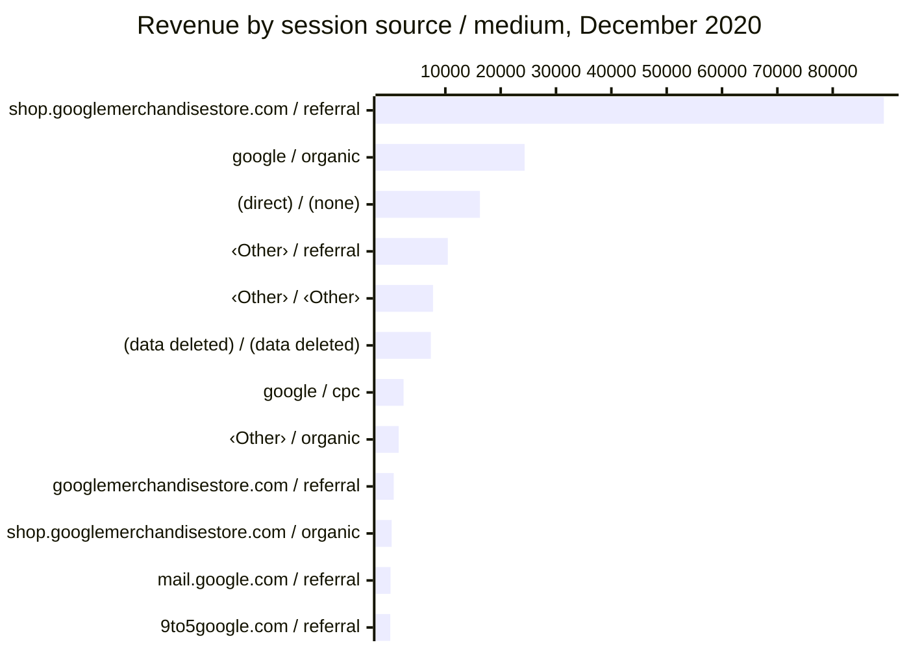
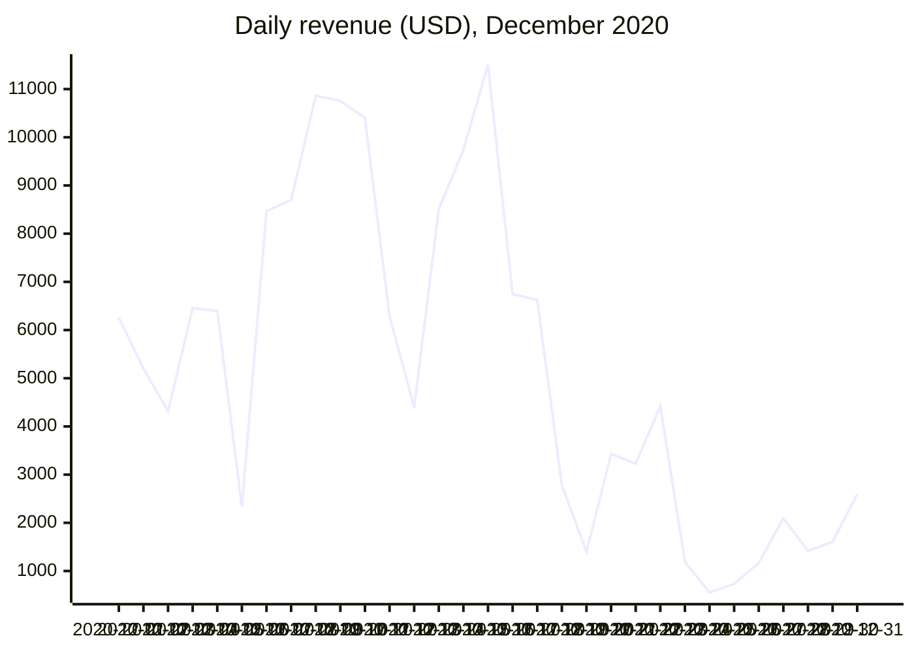
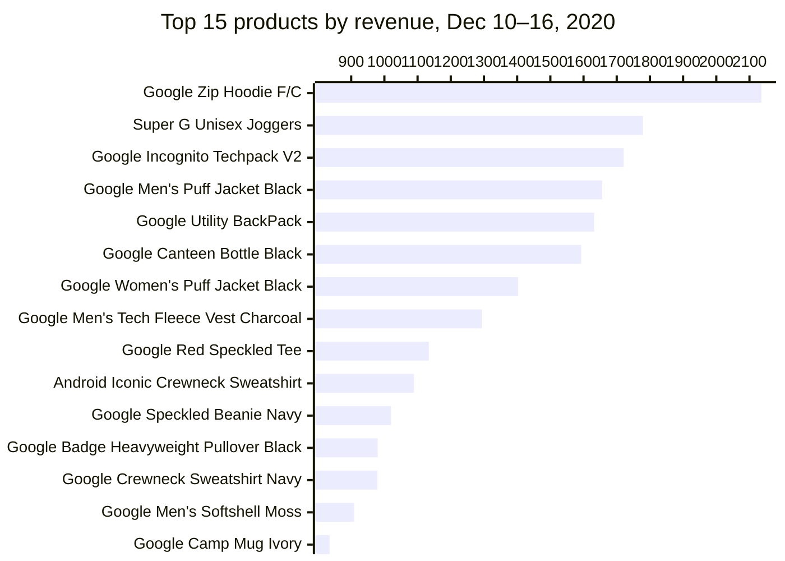
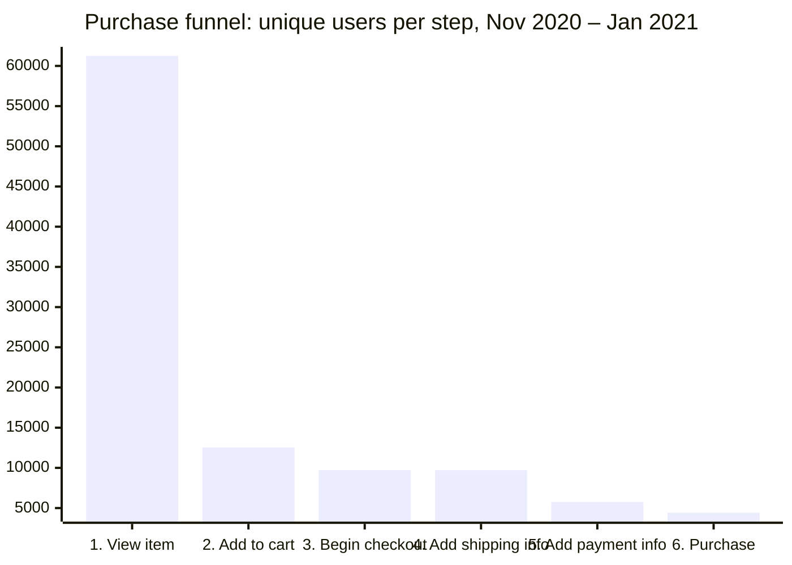
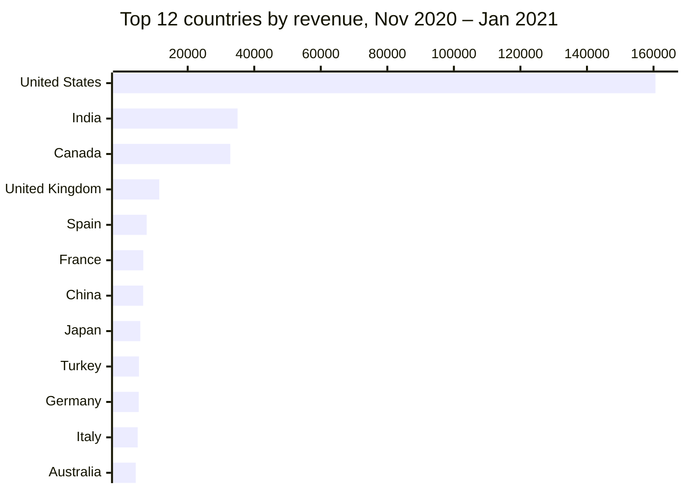

# Example conversations

Generated 2026-09-24 16:05 UTC by `scripts/run_example_conversations.py`: every question below went through the real app (same agent, tools and prompt), with `claude-opus-5-5` at `high` effort and a fresh database. Answers, queries and charts are exactly what the app produced; nothing was edited.

## Summary

| # | What it tests | Questions | Queries | Charts | Time | Cost |
|---|---|---|---|---|---|---|
| 1 | Channel attribution, and a follow-up that depends on context | 2 | 2 | 1 | 58s | $0.18 |
| 2 | A time-series chart, then a drill-down | 2 | 3 | 2 | 49s | $0.13 |
| 3 | Funnel analysis | 1 | 1 | 1 | 33s | $0.06 |
| 4 | Comparing segments | 1 | 2 | 0 | 24s | $0.05 |
| 5 | A ranking, then a breakdown | 2 | 3 | 2 | 70s | $0.12 |
| 6 | Honesty about what the data can't answer | 2 | 3 | 0 | 50s | $0.10 |
| | **Total** | **10** | **14** | **6** | **285s** | **$0.63** |

- BigQuery scanned **3.40 GB** in total (the free tier allows 1 TB per month).
- Queries rejected by BigQuery (the error goes back to the agent): **0**. Failed answers: **0**.
- Cost is estimated from token usage at list prices; time is wall-clock per answer.

## What this run shows

*Notes written after reviewing the answers below; everything else in this document is generated.*

- **All 10 questions answered, with no failed queries**, in about 28 seconds and $0.06 per answer
  on average ($0.63 in total).
- **Numbers are consistent** across answers and with independently validated queries: December
  revenue is $160,555 from 2,434 purchases in every answer that uses it, and the funnel counts
  match `purchase_funnel` in `docs/example_queries.sql` exactly.
- **Follow-ups use context:** "How does that compare to November?" reuses the first answer's
  method and channels; "Break the top 3 down by month" knows which three countries.
- **Charts are chosen to fit the data:** a line for the daily trend, horizontal bars for rankings,
  grouped bars for countries by month, and no chart for the device comparison ("the three bars
  would look nearly identical").
- **Dataset traps are handled and explained:** session-level vs first-touch attribution, the
  store's self-referral inflating one channel, obfuscated values (`<Other>`, `(data deleted)`),
  UTC dates, and small samples (tablet, Italy, Australia).
- **Limits are stated, not papered over:** March 2022 is refused with the months that do exist;
  "lifetime value" becomes a clearly labelled 3-month customer value by first-visit cohort.
- **Room for improvement:** answers are long (often 300-500 words) and some recommendations go
  beyond the data (e.g. "the drop likely reflects shipping cutoffs", labelled as likely). Tuning
  the prompt for shorter answers is the next step, and rerunning this script shows whether a
  change helps.

## 1. Channel attribution, and a follow-up that depends on context

### Q: Which traffic channels drove the most revenue in December 2020?

*32s · $0.111 · 3 model calls · 1 query · tokens: 8 input, 20,854 cache read, 11,895 cache write, 2,370 output*

<details>
<summary>Query: Session-level source/medium revenue, sessions and conversion for December 2020. (12 rows, 573.3 MB scanned)</summary>

```sql
WITH sessions AS (
  SELECT
    CONCAT(user_pseudo_id, CAST((SELECT value.int_value FROM UNNEST(event_params) WHERE key = 'ga_session_id') AS STRING)) AS session_id,
    ANY_VALUE((SELECT value.string_value FROM UNNEST(event_params) WHERE key = 'source')) AS source,
    ANY_VALUE((SELECT value.string_value FROM UNNEST(event_params) WHERE key = 'medium')) AS medium,
    COUNTIF(event_name = 'purchase') AS purchases,
    SUM(IF(event_name = 'purchase', ecommerce.purchase_revenue_in_usd, 0)) AS revenue
  FROM `bigquery-public-data.ga4_obfuscated_sample_ecommerce.events_*`
  WHERE _TABLE_SUFFIX BETWEEN '20201201' AND '20201231'
  GROUP BY session_id
),
agg AS (
  SELECT
    CONCAT(IFNULL(source, '(not set)'), ' / ', IFNULL(medium, '(not set)')) AS source_medium,
    COUNT(*) AS sessions,
    SUM(purchases) AS purchases,
    ROUND(COUNTIF(purchases > 0) / COUNT(*), 4) AS conversion_rate,
    ROUND(SUM(revenue), 2) AS revenue_usd
  FROM sessions
  GROUP BY source_medium
)
SELECT *, ROUND(revenue_usd / SUM(revenue_usd) OVER (), 4) AS revenue_share
FROM agg
ORDER BY revenue_usd DESC
LIMIT 12
```

| source_medium | sessions | purchases | conversion_rate | revenue_usd | revenue_share |
|---|---|---|---|---|---|
| shop.googlemerchandisestore.com / referral | 31232 | 1263 | 0.0349 | 89,239.00 | 0.5558 |
| google / organic | 27981 | 430 | 0.0133 | 24,328.00 | 0.1515 |
| (direct) / (none) | 13573 | 265 | 0.0169 | 16,251.00 | 0.1012 |
| <Other> / referral | 6170 | 141 | 0.0191 | 10,443.00 | 0.065 |
| <Other> / <Other> | 9057 | 130 | 0.0139 | 7,771.00 | 0.0484 |

*First 5 of 12 rows.*

</details>

**Chart (horizontal bar):** Revenue by session source / medium, December 2020



**Answer:**

In December 2020, **shop.googlemerchandisestore.com / referral** is credited with the most revenue: $89.2K, or 56% of the month's roughly $160.6K. That label is probably misleading, though (see below). Next come **Google organic search** at $24.3K (15%) and **direct** traffic at $16.3K (10%). Paid search (google / cpc) brought in only about $2.5K.

I credited each session's revenue to the source/medium recorded on that visit, not the channel that first brought the user in. The chart shows every channel ranked by revenue.

| Source / medium | Sessions | Purchases | Session conv. rate | Revenue | Share |
|---|---|---|---|---|---|
| shop.googlemerchandisestore.com / referral | 31,232 | 1,263 | 3.5% | $89,239 | 55.6% |
| google / organic | 27,981 | 430 | 1.3% | $24,328 | 15.2% |
| (direct) / (none) | 13,573 | 265 | 1.7% | $16,251 | 10.1% |
| \<Other> / referral | 6,170 | 141 | 1.9% | $10,443 | 6.5% |
| \<Other> / \<Other> | 9,057 | 130 | 1.4% | $7,771 | 4.8% |
| (data deleted) | 2,342 | 119 | 4.2% | $7,378 | 4.6% |
| google / cpc | 2,830 | 42 | 1.4% | $2,454 | 1.5% |

**What this means:**
- **The top "channel" probably isn't a real traffic source.** shop.googlemerchandisestore.com is the store's own domain. When the store refers traffic to itself, it's usually because that domain isn't set to be ignored as a referrer, or because visitors cross between subdomains during checkout. That would also explain its high 3.5% conversion rate. Those sessions likely started on Google search, direct visits or other channels, so the organic and direct figures are probably understated. Adding the store's domains to GA4's list of referrals to ignore would give a truer picture.
- **Among real channels, Google organic search leads.** It brings in almost as many sessions as the top channel, though it converts at only 1.3%. Direct traffic converts a little better at 1.7%.
- **Paid search is small.** It accounts for 1.5% of revenue. In this sample that could reflect limited ad spend rather than poor performance.

**Caveats:** About 16% of revenue sits under \<Other> or (data deleted). These are placeholders in Google's deliberately scrambled public sample, not real channels, so the true ranking of the smaller channels is uncertain. Dates are in UTC.

If you'd like, I can run the same breakdown by the channel that first brought each user in. That view isn't affected by the store's self-referrals.

---

### Q: How does that compare to November?

*27s · $0.066 · 2 model calls · 1 query · tokens: 6 input, 24,802 cache read, 2,798 cache write, 2,351 output*

<details>
<summary>Query: Same session-level source/medium breakdown for November 2020. (12 rows, 514.5 MB scanned)</summary>

```sql
WITH sessions AS (
  SELECT
    SUBSTR(_TABLE_SUFFIX, 1, 6) AS month,
    CONCAT(user_pseudo_id, CAST((SELECT value.int_value FROM UNNEST(event_params) WHERE key = 'ga_session_id') AS STRING)) AS session_id,
    ANY_VALUE((SELECT value.string_value FROM UNNEST(event_params) WHERE key = 'source')) AS source,
    ANY_VALUE((SELECT value.string_value FROM UNNEST(event_params) WHERE key = 'medium')) AS medium,
    COUNTIF(event_name = 'purchase') AS purchases,
    SUM(IF(event_name = 'purchase', ecommerce.purchase_revenue_in_usd, 0)) AS revenue
  FROM `bigquery-public-data.ga4_obfuscated_sample_ecommerce.events_*`
  WHERE _TABLE_SUFFIX BETWEEN '20201101' AND '20201130'
  GROUP BY month, session_id
),
agg AS (
  SELECT
    CONCAT(IFNULL(source, '(not set)'), ' / ', IFNULL(medium, '(not set)')) AS source_medium,
    COUNT(*) AS sessions,
    SUM(purchases) AS purchases,
    ROUND(COUNTIF(purchases > 0) / COUNT(*), 4) AS conversion_rate,
    ROUND(SUM(revenue), 2) AS revenue_usd
  FROM sessions
  GROUP BY source_medium
)
SELECT *, ROUND(revenue_usd / SUM(revenue_usd) OVER (), 4) AS revenue_share
FROM agg
ORDER BY revenue_usd DESC
LIMIT 12
```

| source_medium | sessions | purchases | conversion_rate | revenue_usd | revenue_share |
|---|---|---|---|---|---|
| shop.googlemerchandisestore.com / referral | 30340 | 1158 | 0.0301 | 83,454.00 | 0.5785 |
| google / organic | 20335 | 306 | 0.0113 | 21,443.00 | 0.1486 |
| (direct) / (none) | 11348 | 193 | 0.0136 | 13,985.00 | 0.0969 |
| <Other> / <Other> | 7609 | 141 | 0.0133 | 8,430.00 | 0.0584 |
| <Other> / referral | 5195 | 115 | 0.0187 | 8,396.00 | 0.0582 |

*First 5 of 12 rows.*

</details>

**Answer:**

December revenue was up about **11%** on November, rising from roughly **$144.3K to $160.6K**. The channel ranking barely changed: the store's own domain (shop.googlemerchandisestore.com), Google organic search and direct traffic were the top three in both months. Almost all of the growth came from real channels. The self-referral entry grew least, so its share of revenue fell from 58% to 56%.

| Source / medium | Nov revenue | Dec revenue | Change | Nov → Dec sessions | Nov → Dec conv. rate |
|---|---|---|---|---|---|
| shop.googlemerchandisestore.com / referral | $83,454 | $89,239 | +7% | 30,340 → 31,232 | 3.0% → 3.5% |
| google / organic | $21,443 | $24,328 | +13% | 20,335 → 27,981 | 1.1% → 1.3% |
| (direct) / (none) | $13,985 | $16,251 | +16% | 11,348 → 13,573 | 1.4% → 1.7% |
| \<Other> / referral | $8,396 | $10,443 | +24% | 5,195 → 6,170 | 1.9% → 1.9% |
| \<Other> / \<Other> | $8,430 | $7,771 | −8% | 7,609 → 9,057 | 1.3% → 1.4% |
| (data deleted) | $3,897 | $7,378 | +89% | 1,954 → 2,342 | 2.8% → 4.2% |
| google / cpc | $1,780 | $2,454 | +38% | 2,254 → 2,830 | 1.3% → 1.4% |
| \<Other> / organic | $2,180 | $1,567 | −28% | 1,487 → 1,748 | 1.3% → 1.5% |

**What changed:**
- **Organic search brought the most new traffic.** Its sessions rose 38%, far more than any other large channel, and conversion also improved. Revenue rose less than traffic (+13%), which suggests the extra December visitors spent less per order.
- **Direct traffic grew on both traffic and conversion.** Sessions rose 20% and conversion went from 1.4% to 1.7%. That fits holiday shopping by returning customers who already know the store.
- **Paid search grew fastest among named channels (+38%)** but from a small base: it was still only about 1.5% of revenue.
- **Two of the biggest jumps and drops are in scrambled categories.** "(data deleted)" rose 89% and "\<Other> / organic" fell 28%. These are placeholders in Google's deliberately scrambled public sample, so we can't tell which real channels are behind them.

**Caveats:** This uses the same method as before, crediting revenue to the source on each visit. The self-referral problem affects both months, so the gains for organic and direct are probably understated in both. December also has one more day than November, which accounts for about 3 points of the 11% growth. Dates are in UTC.

---

## 2. A time-series chart, then a drill-down

### Q: Show me the daily revenue trend for December 2020.

*23s · $0.051 · 3 model calls · 1 query · tokens: 8 input, 29,596 cache read, 2,345 cache write, 1,688 output*

<details>
<summary>Query: Daily purchases and revenue (USD) for December 2020. (31 rows, 35.5 MB scanned)</summary>

```sql
SELECT
  PARSE_DATE('%Y%m%d', event_date) AS day,
  COUNTIF(event_name = 'purchase') AS purchases,
  ROUND(SUM(IF(event_name = 'purchase', ecommerce.purchase_revenue_in_usd, 0)), 2) AS revenue_usd
FROM `bigquery-public-data.ga4_obfuscated_sample_ecommerce.events_*`
WHERE _TABLE_SUFFIX BETWEEN '20201201' AND '20201231'
GROUP BY day
ORDER BY day
```

| day | purchases | revenue_usd |
|---|---|---|
| 2020-12-01 | 107 | 6,258.00 |
| 2020-12-02 | 82 | 5,201.00 |
| 2020-12-03 | 90 | 4,317.00 |
| 2020-12-04 | 96 | 6,458.00 |
| 2020-12-05 | 87 | 6,396.00 |

*First 5 of 31 rows.*

</details>

**Chart (line):** Daily revenue (USD), December 2020



**Answer:**

In December 2020 the store made **$160,555 in revenue from 2,434 purchases**. Most of it came in the first half of the month. Sales peaked mid-month and dropped sharply from December 19 through the holidays. The chart above shows the daily line.

**How the month played out:**
- **Dec 1–5:** a steady start at about $4.3K–$6.5K a day.
- **Dec 7–16:** the peak. Most weekdays brought in $8.5K–$11.5K. The best day was **Wednesday, Dec 16 at $11,509**, followed by Dec 9 ($10,863) and Dec 10 ($10,756).
- **Weekend dips:** Sundays were consistently weakest: Dec 6 ($2,328), Dec 13 ($4,395) and Dec 20 ($1,399).
- **Dec 19–31:** a steep drop to about $2.0K a day on average. The lowest day was **Christmas Day at $552**, and sales stayed low through New Year's Eve.

| Period | Revenue | Share of month | Avg per day |
|---|---|---|---|
| Dec 1–18 | $133,944 | 83% | ~$7,440 |
| Dec 19–31 | $26,611 | 17% | ~$2,050 |

**What this means for the business:** December revenue depended heavily on holiday gift buying that ended about a week before Christmas. The drop likely reflects shipping cutoffs. Promotions and marketing budget would do the most good in the first two to three weeks of December. Late in the month, pushing faster shipping options or digital or gift-card products could win back some of the lost sales.

**Caveats:** Revenue is `purchase_revenue_in_usd`. Days follow the dataset's `event_date`, not the customer's local time. This is an obfuscated sample, so treat the figures as showing the pattern rather than exact store totals.

---

### Q: Which products sold best during the busiest week?

*26s · $0.079 · 3 model calls · 2 queries · tokens: 8 input, 39,005 cache read, 3,830 cache write, 2,604 output*

<details>
<summary>Query: Top products by item revenue during the busiest 7-day window, Dec 10–16, 2020. (15 rows, 46.0 MB scanned)</summary>

```sql
SELECT
  i.item_name,
  i.item_category,
  SUM(i.quantity) AS units_sold,
  COUNT(DISTINCT CONCAT(user_pseudo_id, CAST(event_timestamp AS STRING))) AS orders,
  ROUND(SUM(i.item_revenue_in_usd), 2) AS revenue_usd
FROM `bigquery-public-data.ga4_obfuscated_sample_ecommerce.events_*`, UNNEST(items) AS i
WHERE _TABLE_SUFFIX BETWEEN '20201210' AND '20201216'
  AND event_name = 'purchase'
  AND i.item_name != '(not set)'
GROUP BY i.item_name, i.item_category
ORDER BY revenue_usd DESC
LIMIT 15
```

| item_name | item_category | units_sold | orders | revenue_usd |
|---|---|---|---|---|
| Google Zip Hoodie F/C | Apparel | 43 | 42 | 2,136.00 |
| Super G Unisex Joggers | Shop by Brand | 58 | 51 | 1,779.00 |
| Google Incognito Techpack V2 | Bags | 22 | 14 | 1,721.00 |
| Google Men's Puff Jacket Black | Apparel | 18 | 16 | 1,656.00 |
| Google Utility BackPack | Bags | 17 | 16 | 1,632.00 |

*First 5 of 15 rows.*

</details>

<details>
<summary>Query: Totals for Dec 10–16 to compute product shares and the size of '(not set)' items. (1 row, 21.7 MB scanned)</summary>

```sql
SELECT
  COUNT(*) AS purchases,
  ROUND(SUM(ecommerce.purchase_revenue_in_usd), 2) AS order_revenue_usd,
  (SELECT ROUND(SUM(i.item_revenue_in_usd), 2)
   FROM `bigquery-public-data.ga4_obfuscated_sample_ecommerce.events_*`, UNNEST(items) AS i
   WHERE _TABLE_SUFFIX BETWEEN '20201210' AND '20201216' AND event_name = 'purchase') AS item_revenue_all,
  (SELECT ROUND(SUM(i.item_revenue_in_usd), 2)
   FROM `bigquery-public-data.ga4_obfuscated_sample_ecommerce.events_*`, UNNEST(items) AS i
   WHERE _TABLE_SUFFIX BETWEEN '20201210' AND '20201216' AND event_name = 'purchase' AND i.item_name = '(not set)') AS item_revenue_not_set
FROM `bigquery-public-data.ga4_obfuscated_sample_ecommerce.events_*`
WHERE _TABLE_SUFFIX BETWEEN '20201210' AND '20201216'
  AND event_name = 'purchase'
```

| purchases | order_revenue_usd | item_revenue_all | item_revenue_not_set |
|---|---|---|---|
| 864 | 61,587.00 | 61,567.00 |  |

</details>

**Chart (horizontal bar):** Top 15 products by revenue, Dec 10–16, 2020



**Answer:**

I used **Dec 10–16, 2020** as the busiest week, since those 7 days brought in the most revenue of any 7 days in December: **$61,587 from 864 purchases**. In that week, **warm apparel and bags sold best**. The top seller was the **Google Zip Hoodie F/C** at $2,136, followed by the Super G Unisex Joggers ($1,779) and the Google Incognito Techpack V2 ($1,721). The chart above ranks the top 15 by revenue.

| # | Product | Category | Units | Revenue |
|---|---|---|---|---|
| 1 | Google Zip Hoodie F/C | Apparel | 43 | $2,136 |
| 2 | Super G Unisex Joggers | Shop by Brand | 58 | $1,779 |
| 3 | Google Incognito Techpack V2 | Bags | 22 | $1,721 |
| 4 | Google Men's Puff Jacket Black | Apparel | 18 | $1,656 |
| 5 | Google Utility BackPack | Bags | 17 | $1,632 |

**What stands out:**
- **Winter clothing leads.** Hoodies, puff jackets, fleece vests, sweatshirts and a beanie make up most of the top 15. That fits holiday gift buying in cold weather.
- **Higher-priced items earn a lot from few sales.** Each puff jacket, backpack and the Techpack sold fewer than 25 units but still made $1,400–$1,700.
- **Low-priced items sell by volume.** The **Google Canteen Bottle Black** sold the most units (82), often several per order. The **Google Camp Mug Ivory** was in the most orders (69), which makes it a popular add-on.
- **Revenue is spread thin.** The top 15 products together earned about $20.2K, roughly a third of the week's item revenue. No single product earned more than about 3.5%.

**What this means for the business:** For next year's holiday peak, keep stock deep on the winter clothing and bags that earn the most. Offer cheap drinkware as add-ons in bundles or at checkout, since shoppers already add them to orders.

**Caveats:** Revenue here is `item_revenue_in_usd` from purchases. It adds up almost exactly to the week's order revenue ($61,567 vs $61,587), and no revenue was lost to '(not set)' product names. Category names come from purchase events and can be inconsistent (for example, "Shop by Brand" and "New"). Figures come from the obfuscated sample.

---

## 3. Funnel analysis

### Q: What does the purchase funnel look like, and where do users drop off?

*33s · $0.058 · 3 model calls · 1 query · tokens: 8 input, 29,628 cache read, 1,963 cache write, 2,110 output*

<details>
<summary>Query: Count unique users reaching each funnel step (Nov 2020–Jan 2021) with step-to-step conversion. (6 rows, 138.1 MB scanned)</summary>

```sql
WITH u AS (
  SELECT
    COUNT(DISTINCT IF(event_name = 'view_item', user_pseudo_id, NULL)) AS s1,
    COUNT(DISTINCT IF(event_name = 'add_to_cart', user_pseudo_id, NULL)) AS s2,
    COUNT(DISTINCT IF(event_name = 'begin_checkout', user_pseudo_id, NULL)) AS s3,
    COUNT(DISTINCT IF(event_name = 'add_shipping_info', user_pseudo_id, NULL)) AS s4,
    COUNT(DISTINCT IF(event_name = 'add_payment_info', user_pseudo_id, NULL)) AS s5,
    COUNT(DISTINCT IF(event_name = 'purchase', user_pseudo_id, NULL)) AS s6
  FROM `bigquery-public-data.ga4_obfuscated_sample_ecommerce.events_*`
  WHERE _TABLE_SUFFIX BETWEEN '20201101' AND '20210131'
    AND event_name IN ('view_item','add_to_cart','begin_checkout','add_shipping_info','add_payment_info','purchase')
),
steps AS (
  SELECT 1 AS step_num, '1. View item' AS step, s1 AS users, CAST(NULL AS INT64) AS prev, s1 AS first FROM u UNION ALL
  SELECT 2, '2. Add to cart', s2, s1, s1 FROM u UNION ALL
  SELECT 3, '3. Begin checkout', s3, s2, s1 FROM u UNION ALL
  SELECT 4, '4. Add shipping info', s4, s3, s1 FROM u UNION ALL
  SELECT 5, '5. Add payment info', s5, s4, s1 FROM u UNION ALL
  SELECT 6, '6. Purchase', s6, s5, s1 FROM u
)
SELECT step, users,
  ROUND(SAFE_DIVIDE(users, prev), 4) AS step_conversion,
  ROUND(1 - SAFE_DIVIDE(users, prev), 4) AS step_dropoff,
  ROUND(users / first, 4) AS pct_of_viewers
FROM steps ORDER BY step_num
```

| step | users | step_conversion | step_dropoff | pct_of_viewers |
|---|---|---|---|---|
| 1. View item | 61252 |  |  | 1.00 |
| 2. Add to cart | 12545 | 0.2048 | 0.7952 | 0.2048 |
| 3. Begin checkout | 9715 | 0.7744 | 0.2256 | 0.1586 |
| 4. Add shipping info | 9714 | 0.9999 | 0.0001 | 0.1586 |
| 5. Add payment info | 5751 | 0.592 | 0.408 | 0.0939 |

*First 5 of 6 rows.*

</details>

**Chart (bar):** Purchase funnel: unique users per step, Nov 2020 – Jan 2021



**Answer:**

About 7.2% of users who viewed a product went on to buy (4,419 out of 61,252) between 1 Nov 2020 and 31 Jan 2021. Most people leave at the first step: about 80% of product viewers never add anything to their cart. The second-biggest loss is between entering shipping details and entering payment details. The chart shows how many users reach each step.

| Step | Users | Moved on from previous step | Dropped off | % of viewers |
|---|---|---|---|---|
| View item | 61,252 | – | – | 100% |
| Add to cart | 12,545 | 20.5% | **79.5%** | 20.5% |
| Begin checkout | 9,715 | 77.4% | 22.6% | 15.9% |
| Add shipping info | 9,714 | ~100% | ~0% | 15.9% |
| Add payment info | 5,751 | 59.2% | **40.8%** | 9.4% |
| Purchase | 4,419 | 76.8% | 23.2% | 7.2% |

**Where users drop off:**
1. **Product page → cart (79.5% lost).** This is the biggest loss by far, about 48.7K users. Some of it is normal browsing. Still, product pages are the best place to improve: pricing and shipping cost shown clearly, product images, stock information, and a more prominent add-to-cart button.
2. **Shipping → payment (40.8% lost).** About 4K users who had already started checkout left here. People who get this far clearly mean to buy, so this is the most valuable loss to fix. Common causes are shipping costs or delivery dates that only appear at this point, too few payment options, or forced account creation. Checking the checkout pages for these issues would be a good start.
3. **Cart → checkout (22.6%) and payment → purchase (23.2%)** are moderate losses. Following up on abandoned carts, and investigating payment failures or errors, could win back some of these users.

**Caveats:**
- Nearly every user who began checkout also has a shipping-info event (only one missing). That probably means the shipping-info event fires automatically when the checkout page loads, rather than showing real user progress. In practice, begin checkout and shipping should be treated as one step, which makes the checkout → payment step the real problem.
- This is a count of unique users per step over the whole period. It doesn't require users to do the steps in order or in one visit. A version per visit (session) would give lower conversion rates at each step.

---

## 4. Comparing segments

### Q: How do desktop, mobile and tablet compare on conversion rate and average order value?

*24s · $0.049 · 2 model calls · 2 queries · tokens: 6 input, 18,721 cache read, 1,807 cache write, 1,794 output*

<details>
<summary>Query: Compare users, purchasers, conversion rate, revenue and AOV by device category (Nov 2020–Jan 2021). (3 rows, 173.3 MB scanned)</summary>

```sql
SELECT
  device.category AS device,
  COUNT(DISTINCT user_pseudo_id) AS users,
  COUNT(DISTINCT IF(event_name = 'purchase', user_pseudo_id, NULL)) AS purchasers,
  ROUND(SAFE_DIVIDE(COUNT(DISTINCT IF(event_name = 'purchase', user_pseudo_id, NULL)), COUNT(DISTINCT user_pseudo_id)), 4) AS user_conversion_rate,
  COUNTIF(event_name = 'purchase') AS purchases,
  ROUND(SUM(IF(event_name = 'purchase', ecommerce.purchase_revenue_in_usd, 0)), 2) AS revenue_usd,
  ROUND(AVG(IF(event_name = 'purchase', ecommerce.purchase_revenue_in_usd, NULL)), 2) AS avg_order_value
FROM `bigquery-public-data.ga4_obfuscated_sample_ecommerce.events_*`
WHERE _TABLE_SUFFIX BETWEEN '20201101' AND '20210131'
GROUP BY device
ORDER BY users DESC
```

| device | users | purchasers | user_conversion_rate | purchases | revenue_usd | avg_order_value |
|---|---|---|---|---|---|---|
| desktop | 158917 | 2541 | 0.016 | 3226 | 208,815.00 | 64.73 |
| mobile | 109195 | 1851 | 0.017 | 2355 | 146,768.00 | 62.32 |
| tablet | 6250 | 97 | 0.0155 | 111 | 6,582.00 | 59.30 |

</details>

<details>
<summary>Query: Session-level conversion rate by device category (Nov 2020–Jan 2021). (3 rows, 984.2 MB scanned)</summary>

```sql
WITH s AS (
  SELECT device.category AS device, user_pseudo_id,
    (SELECT value.int_value FROM UNNEST(event_params) WHERE key = 'ga_session_id') AS sid,
    COUNTIF(event_name = 'purchase') > 0 AS converted
  FROM `bigquery-public-data.ga4_obfuscated_sample_ecommerce.events_*`
  WHERE _TABLE_SUFFIX BETWEEN '20201101' AND '20210131'
  GROUP BY device, user_pseudo_id, sid
)
SELECT device, COUNT(*) AS sessions, COUNTIF(converted) AS converting_sessions,
  ROUND(COUNTIF(converted)/COUNT(*), 4) AS session_conversion_rate
FROM s WHERE sid IS NOT NULL
GROUP BY device ORDER BY sessions DESC
```

| device | sessions | converting_sessions | session_conversion_rate |
|---|---|---|---|
| desktop | 208942 | 2749 | 0.0132 |
| mobile | 143185 | 1995 | 0.0139 |
| tablet | 8002 | 104 | 0.013 |

</details>

**Answer:**

The three devices perform almost the same. Conversion rates are all between 1.3% and 1.7%, and average order values are all between $59 and $65. Mobile converts slightly better, and desktop has slightly bigger orders. These figures cover the full dataset, 1 Nov 2020 to 31 Jan 2021.

| Device | Users | User conv. rate | Session conv. rate | Orders | Avg order value | Revenue | Share of revenue |
|---|---|---|---|---|---|---|---|
| Desktop | 158,917 | 1.60% | 1.32% | 3,226 | $64.73 | $208,815 | ~58% |
| Mobile | 109,195 | **1.70%** | **1.39%** | 2,355 | $62.32 | $146,768 | ~41% |
| Tablet | 6,250 | 1.55% | 1.30% | 111 | $59.30 | $6,582 | ~2% |

**What this means:**
- **Conversion:** Mobile is ahead on both measures, by about 0.1 percentage points. That's a small gap, not a sign that one device's checkout works much better than another's. The usual pattern of mobile converting worse than desktop doesn't show up here, so the mobile experience seems to be holding its own.
- **Average order value:** Desktop orders are about $2.40 bigger than mobile orders and about $5.40 bigger than tablet orders. So desktop brings in more money per buyer, even though it converts slightly less often.
- **Where to focus:** Desktop and mobile together bring in about 98% of revenue. Tablet is too small to prioritise. With only 111 orders, its numbers are also less reliable, so treat its lower rate and order value as unconfirmed.

**How the rates are calculated:**
- User conversion is the share of users who bought at least once.
- Session conversion is the share of visits that included a purchase.
- Average order value is revenue divided by purchase events, using `purchase_revenue_in_usd`.

A user who visits on two devices would count once under each device. I didn't include a chart because the three bars would look nearly identical.

---

## 5. A ranking, then a breakdown

### Q: Which countries bring the most revenue?

*28s · $0.047 · 3 model calls · 1 query · tokens: 8 input, 29,456 cache read, 1,780 cache write, 1,599 output*

<details>
<summary>Query: Rank countries by purchase revenue over the full data period (Nov 2020–Jan 2021). (12 rows, 186.1 MB scanned)</summary>

```sql
WITH c AS (
SELECT
  geo.country,
  COUNT(DISTINCT user_pseudo_id) AS users,
  COUNTIF(event_name = 'purchase') AS purchases,
  SUM(IF(event_name = 'purchase', ecommerce.purchase_revenue_in_usd, 0)) AS revenue_usd
FROM `bigquery-public-data.ga4_obfuscated_sample_ecommerce.events_*`
WHERE _TABLE_SUFFIX BETWEEN '20201101' AND '20210131'
GROUP BY geo.country
)
SELECT country, users, purchases, ROUND(revenue_usd,2) AS revenue_usd,
  ROUND(revenue_usd / SUM(revenue_usd) OVER (), 4) AS revenue_share,
  ROUND(SAFE_DIVIDE(revenue_usd, purchases),2) AS avg_order_value
FROM c
ORDER BY revenue_usd DESC
LIMIT 12
```

| country | users | purchases | revenue_usd | revenue_share | avg_order_value |
|---|---|---|---|---|---|
| United States | 118493 | 2481 | 160,573.00 | 0.4434 | 64.72 |
| India | 25367 | 530 | 34,986.00 | 0.0966 | 66.01 |
| Canada | 20268 | 466 | 32,799.00 | 0.0906 | 70.38 |
| United Kingdom | 8527 | 177 | 11,458.00 | 0.0316 | 64.73 |
| Spain | 5044 | 131 | 7,681.00 | 0.0212 | 58.63 |

*First 5 of 12 rows.*

</details>

**Chart (horizontal bar):** Top 12 countries by revenue, Nov 2020 – Jan 2021



**Answer:**

The **United States** brings in the most revenue by a wide margin: **$160.6K, or 44% of all revenue** from Nov 2020 to Jan 2021. **India** is next with $35.0K (10%), then **Canada** with $32.8K (9%). Together these three make up about 63% of revenue. After them it drops off sharply: the UK is fourth with only 3%.

| Country | Users | Purchases | Revenue (USD) | Share | Avg order |
|---|---|---|---|---|---|
| United States | 118,493 | 2,481 | $160,573 | 44.3% | $64.72 |
| India | 25,367 | 530 | $34,986 | 9.7% | $66.01 |
| Canada | 20,268 | 466 | $32,799 | 9.1% | $70.38 |
| United Kingdom | 8,527 | 177 | $11,458 | 3.2% | $64.73 |
| Spain | 5,044 | 131 | $7,681 | 2.1% | $58.63 |

The chart shows the top 12. Places 5 to 12 (Spain, France, China, Japan, Turkey, Germany, Italy, Australia) each bring in about $4–8K. The top 12 together account for about 79% of revenue.

**What this means:**
- The US is the core market, so anything that affects US traffic or checkout will hit about half of revenue.
- Each country's revenue roughly matches its user numbers, and average order value sits around $56–84 in most of them. So countries differ mainly in how much traffic they get, not in how much each buyer spends.
- Italy ($82.78) and Australia ($84.19) have the highest average orders, but they're small markets with only 52–60 purchases each, so those averages aren't very reliable.

**Caveats:** Country is based on the visitor's IP location, and the dataset is deliberately scrambled in places, so some location data may be missing or blurred. Revenue here is `purchase_revenue_in_usd`.

---

### Q: Break the top 3 down by month.

*42s · $0.074 · 3 model calls · 2 queries · tokens: 8 input, 36,200 cache read, 3,426 cache write, 2,500 output*

<details>
<summary>Query: Monthly users, purchases and revenue for the US, India and Canada. (9 rows, 227.1 MB scanned)</summary>

```sql
SELECT
  FORMAT_DATE('%Y-%m', PARSE_DATE('%Y%m%d', event_date)) AS month,
  geo.country,
  COUNT(DISTINCT user_pseudo_id) AS users,
  COUNTIF(event_name = 'purchase') AS purchases,
  ROUND(SUM(IF(event_name = 'purchase', ecommerce.purchase_revenue_in_usd, 0)), 2) AS revenue_usd,
  ROUND(SAFE_DIVIDE(SUM(IF(event_name = 'purchase', ecommerce.purchase_revenue_in_usd, 0)), COUNTIF(event_name = 'purchase')), 2) AS avg_order_value
FROM `bigquery-public-data.ga4_obfuscated_sample_ecommerce.events_*`
WHERE _TABLE_SUFFIX BETWEEN '20201101' AND '20210131'
  AND geo.country IN ('United States', 'India', 'Canada')
GROUP BY month, country
ORDER BY month, revenue_usd DESC
```

| month | country | users | purchases | revenue_usd | avg_order_value |
|---|---|---|---|---|---|
| 2020-11 | United States | 34890 | 893 | 65,797.00 | 73.68 |
| 2020-11 | India | 7471 | 189 | 13,132.00 | 69.48 |
| 2020-11 | Canada | 5892 | 169 | 12,729.00 | 75.32 |
| 2020-12 | United States | 45650 | 1075 | 71,958.00 | 66.94 |
| 2020-12 | India | 9772 | 261 | 17,596.00 | 67.42 |

*First 5 of 9 rows.*

</details>

<details>
<summary>Query: Site-wide monthly totals, to check whether the January drop is specific to the top 3 countries. (3 rows, 179.1 MB scanned)</summary>

```sql
SELECT
  FORMAT_DATE('%Y-%m', PARSE_DATE('%Y%m%d', event_date)) AS month,
  COUNT(DISTINCT user_pseudo_id) AS users,
  COUNTIF(event_name = 'purchase') AS purchases,
  ROUND(SUM(IF(event_name = 'purchase', ecommerce.purchase_revenue_in_usd, 0)), 2) AS revenue_usd
FROM `bigquery-public-data.ga4_obfuscated_sample_ecommerce.events_*`
WHERE _TABLE_SUFFIX BETWEEN '20201101' AND '20210131'
GROUP BY month
ORDER BY month
```

| month | users | purchases | revenue_usd |
|---|---|---|---|
| 2020-11 | 79421 | 2054 | 144,260.00 |
| 2020-12 | 104315 | 2434 | 160,555.00 |
| 2021-01 | 94790 | 1204 | 57,350.00 |

</details>

**Chart (bar):** Monthly revenue, top 3 countries, Nov 2020 – Jan 2021

```mermaid
xychart-beta
    title "Monthly revenue, top 3 countries, Nov 2020 – Jan 2021"
    x-axis ["2020-11", "2020-12", "2021-01"]
    bar [65797, 71958, 22818]
    bar [13132, 17596, 4258]
    bar [12729, 13723, 6347]
```



Series, in order: United States, India, Canada.

**Answer:**

All three countries grew from November to December, then **fell sharply in January 2021**. India fell the most, dropping from 2nd to 3rd behind Canada.

| Country | Month | Users | Purchases | Revenue | Avg order |
|---|---|---|---|---|---|
| United States | Nov | 34,890 | 893 | $65,797 | $73.68 |
| | Dec | 45,650 | 1,075 | $71,958 | $66.94 |
| | Jan | 41,567 | 513 | $22,818 | $44.48 |
| India | Nov | 7,471 | 189 | $13,132 | $69.48 |
| | Dec | 9,772 | 261 | $17,596 | $67.42 |
| | Jan | 8,915 | 80 | $4,258 | $53.23 |
| Canada | Nov | 5,892 | 169 | $12,729 | $75.32 |
| | Dec | 7,982 | 186 | $13,723 | $73.78 |
| | Jan | 7,043 | 111 | $6,347 | $57.18 |

**Key points (the chart shows monthly revenue by country):**
- **December was the peak.** From November to December, India's revenue grew 34%, the US 9% and Canada 8%.
- **January fell hard:** −68% for the US, −76% for India and −54% for Canada compared with December.
- **It's a buying problem, not a traffic problem.** Users fell only 9–12% in January. But fewer of them bought, and those who did spent less. For example, the share of US users who bought fell from 2.35% to 1.23%, and the average US order fell from $67 to $44. India's share of buyers fell from 2.67% to 0.90%.
- **The whole site shows the same pattern.** Site-wide revenue fell 64% from December ($160.6K) to January ($57.4K), with users down only 9%. So this isn't specific to these countries. The most likely explanation is the usual slump after the holiday shopping season. The data can't show whether the site also changed prices or promotions in January. Together these three countries brought in about 64% of revenue in November and December, and 58% in January.

**What this means:** Canada held up best, and India, the fastest grower in December, fell the most. If January's lower spending looks worse than a normal holiday slump, it would be worth checking promotions and the product mix for India and the US.

**Caveats:** Users are counted separately each month, so the monthly figures add up to more than the three-month totals in my previous answer. Months are based on UTC dates. With only three months of data, I can't compare against last year to see how much of the drop is normal for January.

---

## 6. Honesty about what the data can't answer

### Q: What was our revenue in March 2022?

*17s · $0.024 · 2 model calls · 1 query · tokens: 6 input, 18,707 cache read, 737 cache write, 811 output*

<details>
<summary>Query: Get monthly revenue for the months the dataset actually covers, as an alternative to March 2022. (3 rows, 94.4 MB scanned)</summary>

```sql
SELECT
  FORMAT_DATE('%Y-%m', PARSE_DATE('%Y%m%d', event_date)) AS month,
  COUNTIF(event_name = 'purchase') AS purchases,
  ROUND(SUM(IF(event_name = 'purchase', ecommerce.purchase_revenue_in_usd, 0)), 2) AS revenue_usd
FROM `bigquery-public-data.ga4_obfuscated_sample_ecommerce.events_*`
WHERE _TABLE_SUFFIX BETWEEN '20201101' AND '20210131'
GROUP BY month
ORDER BY month
```

| month | purchases | revenue_usd |
|---|---|---|
| 2020-11 | 2054 | 144,260.00 |
| 2020-12 | 2434 | 160,555.00 |
| 2021-01 | 1204 | 57,350.00 |

</details>

**Answer:**

I can't give you March 2022 revenue because this dataset stops well before then. It only covers **1 Nov 2020 to 31 Jan 2021**.

Here are the months that are in the data:

| Month | Purchases | Revenue (USD) |
|---|---|---|
| Nov 2020 | 2,054 | $144,260 |
| Dec 2020 | 2,434 | $160,555 |
| Jan 2021 | 1,204 | $57,350 |

- **Total for the three months:** about $362K from 5,692 purchases.
- **Most recent month (January 2021):** $57K, about 64% below December. Much of that drop is probably the normal slowdown after the holidays.
- **How revenue is counted:** these figures use `purchase_revenue_in_usd` on purchase events. Dates are in UTC.

For March 2022 figures, you'd need your live GA4 property or its own BigQuery export. With this sample, I could show daily revenue over the holiday period, split January's drop by channel, device or product, or compare order value across the three months.

---

### Q: What is our customer lifetime value?

*33s · $0.076 · 2 model calls · 2 queries · tokens: 6 input, 20,476 cache read, 3,162 cache write, 2,784 output*

<details>
<summary>Query: Compute per-user and per-purchaser value, order frequency and repeat rate over the full Nov 2020–Jan 2021 window. (1 row, 138.1 MB scanned)</summary>

```sql
WITH users AS (
  SELECT
    user_pseudo_id,
    COUNTIF(event_name = 'purchase') AS orders,
    SUM(IF(event_name = 'purchase', ecommerce.purchase_revenue_in_usd, 0)) AS revenue
  FROM `bigquery-public-data.ga4_obfuscated_sample_ecommerce.events_*`
  WHERE _TABLE_SUFFIX BETWEEN '20201101' AND '20210131'
  GROUP BY user_pseudo_id
)
SELECT
  COUNT(*) AS users,
  COUNTIF(orders > 0) AS purchasers,
  ROUND(COUNTIF(orders > 0) / COUNT(*), 4) AS purchaser_share,
  SUM(orders) AS orders,
  ROUND(SUM(revenue), 2) AS revenue_usd,
  ROUND(SUM(revenue) / COUNT(*), 2) AS revenue_per_user,
  ROUND(SAFE_DIVIDE(SUM(revenue), COUNTIF(orders > 0)), 2) AS revenue_per_purchaser,
  ROUND(SAFE_DIVIDE(SUM(orders), COUNTIF(orders > 0)), 2) AS orders_per_purchaser,
  ROUND(SAFE_DIVIDE(SUM(revenue), SUM(orders)), 2) AS avg_order_value,
  ROUND(SAFE_DIVIDE(COUNTIF(orders > 1), COUNTIF(orders > 0)), 4) AS repeat_purchaser_share,
  ROUND(APPROX_QUANTILES(IF(orders > 0, revenue, NULL), 100)[OFFSET(50)], 2) AS median_revenue_per_purchaser,
  ROUND(APPROX_QUANTILES(IF(orders > 0, revenue, NULL), 100)[OFFSET(90)], 2) AS p90_revenue_per_purchaser
FROM users
```

| users | purchasers | purchaser_share | orders | revenue_usd | revenue_per_user | revenue_per_purchaser | orders_per_purchaser | avg_order_value | repeat_purchaser_share | median_revenue_per_purchaser | p90_revenue_per_purchaser |
|---|---|---|---|---|---|---|---|---|---|---|---|
| 270154 | 4419 | 0.0164 | 5692 | 362,165.00 | 1.34 | 81.96 | 1.29 | 63.63 | 0.1754 | 51.00 | 176.00 |

</details>

<details>
<summary>Query: Break value per user down by first-touch month cohort to see how it builds with time. (4 rows, 170.2 MB scanned)</summary>

```sql
WITH users AS (
  SELECT
    user_pseudo_id,
    DATE(TIMESTAMP_MICROS(MIN(user_first_touch_timestamp))) AS first_touch,
    COUNTIF(event_name = 'purchase') AS orders,
    SUM(IF(event_name = 'purchase', ecommerce.purchase_revenue_in_usd, 0)) AS revenue
  FROM `bigquery-public-data.ga4_obfuscated_sample_ecommerce.events_*`
  WHERE _TABLE_SUFFIX BETWEEN '20201101' AND '20210131'
  GROUP BY user_pseudo_id
)
SELECT
  IF(first_touch < '2020-11-01' OR first_touch IS NULL, 'before Nov 2020 / unknown', FORMAT_DATE('%Y-%m', first_touch)) AS cohort,
  COUNT(*) AS users,
  COUNTIF(orders > 0) AS purchasers,
  ROUND(SUM(revenue), 2) AS revenue_usd,
  ROUND(SUM(revenue) / COUNT(*), 2) AS revenue_per_user,
  ROUND(SAFE_DIVIDE(SUM(revenue), COUNTIF(orders > 0)), 2) AS revenue_per_purchaser,
  ROUND(SAFE_DIVIDE(COUNTIF(orders > 1), COUNTIF(orders > 0)), 4) AS repeat_purchaser_share
FROM users
GROUP BY cohort
ORDER BY cohort
```

| cohort | users | purchasers | revenue_usd | revenue_per_user | revenue_per_purchaser | repeat_purchaser_share |
|---|---|---|---|---|---|---|
| 2020-11 | 71738 | 1260 | 119,192.00 | 1.66 | 94.60 | 0.2548 |
| 2020-12 | 96760 | 1478 | 113,550.00 | 1.17 | 76.83 | 0.1198 |
| 2021-01 | 88806 | 772 | 41,990.00 | 0.47 | 54.39 | 0.0764 |
| before Nov 2020 / unknown | 12850 | 909 | 87,433.00 | 6.80 | 96.19 | 0.2398 |

</details>

**Answer:**

We can't measure a true lifetime value here, because the data only covers three months (1 Nov 2020 to 31 Jan 2021). The closest measure is **3-month customer value: about $82 per paying customer, or $1.34 per visitor.**

| Metric (Nov 2020 – Jan 2021) | Value |
|---|---|
| Users / paying customers | 270,154 / 4,419 (1.6% bought) |
| Revenue per user (all visitors) | $1.34 |
| **Revenue per paying customer** | **$81.96** |
| Median / top-10% threshold per customer | $51 / $176 |
| Orders per customer | 1.29 |
| Average order value | $63.63 |
| Customers who bought more than once | 17.5% |

**Value grows the longer we watch a group of customers.** Customers are grouped below by the month of their first visit:

| First visit | Months of data | Revenue per customer | Revenue per user | Bought more than once |
|---|---|---|---|---|
| Nov 2020 | ~3 | $94.60 | $1.66 | 25.5% |
| Dec 2020 | ~2 | $76.83 | $1.17 | 12.0% |
| Jan 2021 | ~1 | $54.39 | $0.47 | 7.6% |
| Before Nov 2020 | 3+ | $96.19 | $6.80 | 24.0% |

The November group is the best guide: about **$95 per customer after 3 months**, with a quarter of them already buying again. Real lifetime value will be higher than that. The "before Nov 2020" row mixes in people who already knew the store, so its $6.80 per user is inflated and shouldn't be used as a benchmark.

**What this means for the business:** most customers buy once (1.29 orders each), so value comes mainly from order size rather than repeat purchases. Getting more first-time buyers to come back is the biggest lever. On current numbers, a new visitor is worth only about $1–2 in the first few months. That caps what we can profitably spend to acquire traffic, unless it converts better than average.

**Caveats:**
- **Short window:** three months, and it includes the holiday peak.
- **Revenue, not profit:** these are revenue figures, not margin.
- **Cookie-based users:** a person on several devices or browsers counts as several users. That overstates the user count and understates repeat buying.

If it helps, I can break customer value down by the channel that first brought people in, or by device.

---

